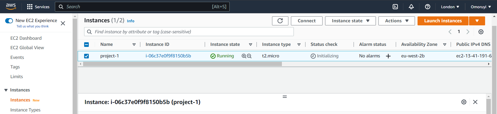
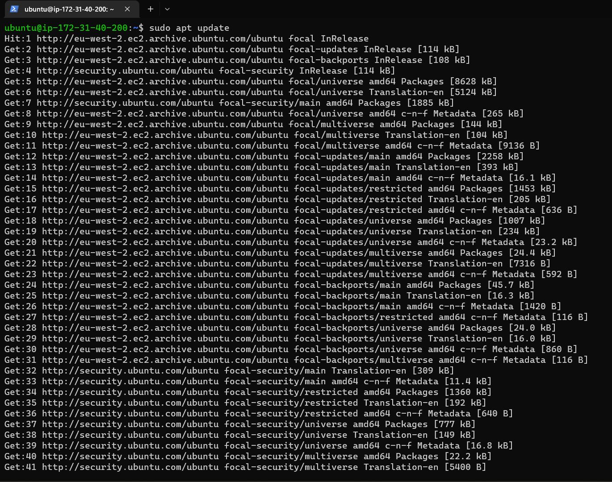
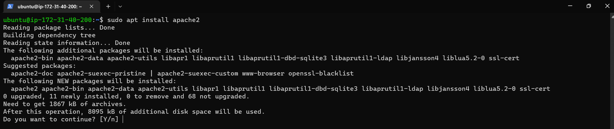

# WEB STACK IMPLEMENTATION (LAMP STACK)
## LAMP (Linux, Apache, MySQL, PHP or Python, or Perl)

## STEP 1 - Setup Instance
We begin by creating our AWS account, then we launch AWS EC2 instance of t2.micro family with Ubuntu Server 20.04 LTS.

---
Next we will get the ssh with which we will connnect to the instance.

---

Now we will connect to our EC2 instance using our windows terminal.

---

We are successfully connected to the instance

---

Now in order to install all necessary tech stacks we need to make sure the instace is up-to-date.

---

Next we will install Apache

