# WEB STACK IMPLEMENTATION (LEMP STACK)
## LAMP (Linux, Engine X (NGINX), MySQL, PHP)
For this task we need an AWS account and on it we have to launch a new EC2 instance of t2.micro family with Ubuntu 22.04 LTS server.
The Private key (.PEM file) should be saved securely and spin up the instance then you connect to the EC2 instance using the terminal on either MAC, Linux or Windows.
We'll be using Windows OS for this project and connecting to our instace using the downloaded Private key (.PEM file).


## Step 1 - Installing NGINX Web Server
First we will bring the server up to date with `sudo apt update` and next we will install NGINX with `sudo apt install nginx` when prompted, enter Y to confirm that you want to install NGINX.

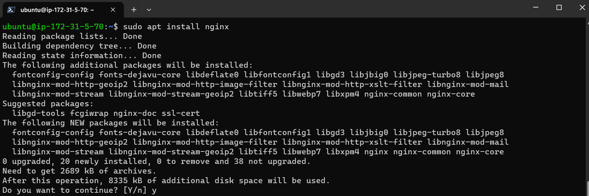

---
Next To verify that nginx was successfully installed and is running as a service in Ubuntu, run `sudo systemctl status nginx`

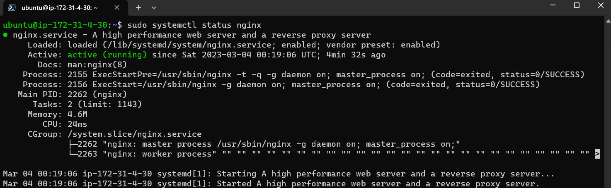

---
As we know, we have TCP port 22 open by default on our EC2 machine to access it via SSH, so we need to add a rule to EC2 configuration to open inbound connection through port 80: Our server is running and we can access it locally and from the Internet (Source 0.0.0.0/0 means ‘from any IP address’). First, let us try to check how we can access it locally in our Ubuntu shell, run `curl http://localhost:80`

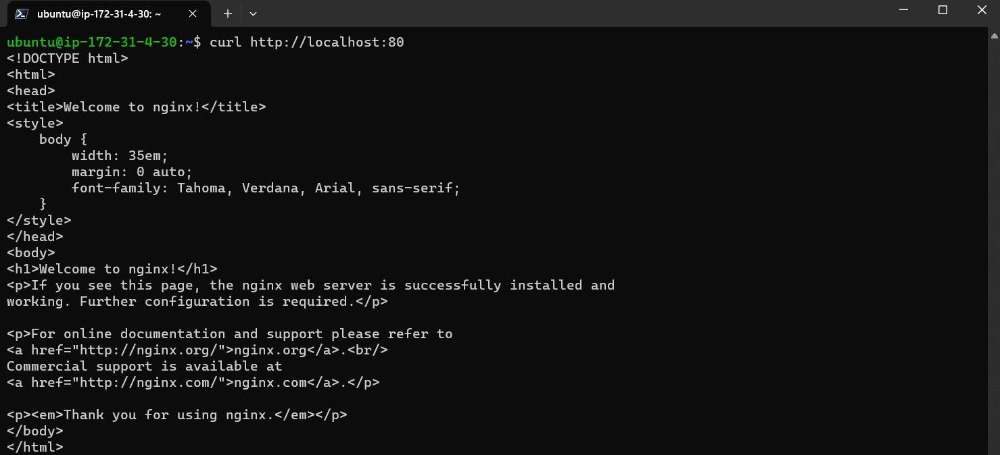

---
Let's test if our Nginx server can respond to requests from the Internet.
Open a web browser of your choice and try to access following url `http://"EC2-intance_Public-IP-Address":80`

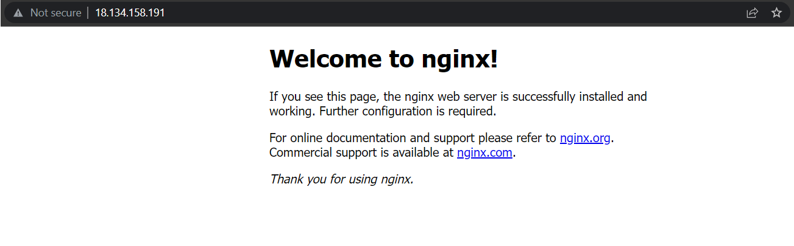
If you see following page, then your web server is now correctly installed and accessible through your firewall.

## Step 2 - Installing MYSQL
To inatall MYSQL run `sudo apt install mysql-server` and when prompted type Y

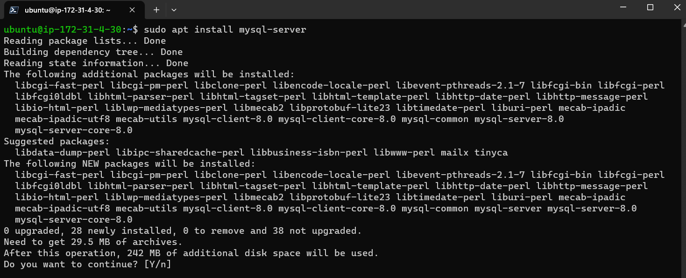

---
When the installation is finished, log in to the MySQL console by typing: `sudo mysql`

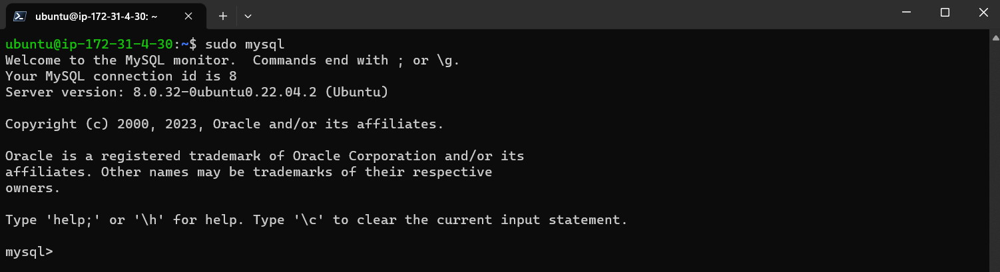

---
Before running the script, you will set a password for the root user, using mysql_native_password as default authentication method. We’re defining this user’s password as PassWord.1 `ALTER USER 'root'@'localhost' IDENTIFIED WITH mysql_native_password BY 'PassWord.1';`

Then exit with `exit`

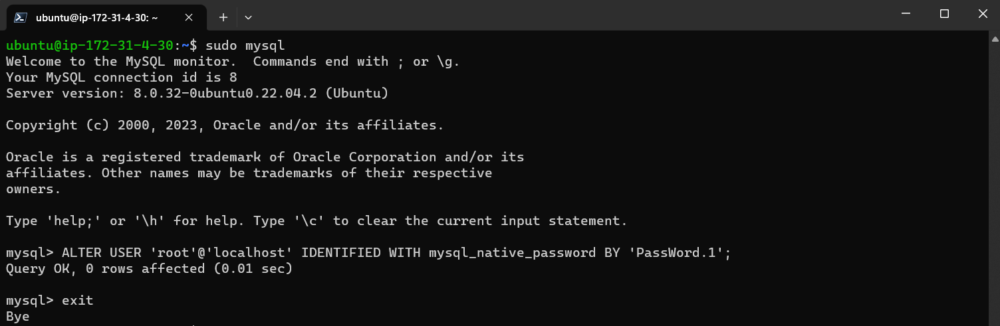

---
Start the interactive script by running `sudo mysql_secure_installation`
This will ask if you want to configure the VALIDATE PASSWORD PLUGIN, Answer Y for yes, or anything else to continue without enabling.

Let's test if we are able to log in to the MySQL console by typing: `sudo mysql -p`
  
Notice the -p flag in this command, which will prompt you for the password used after changing the root user password.

Exit the MySQL console, type: `exit`
Notice that you need to provide a password to connect as the root user.

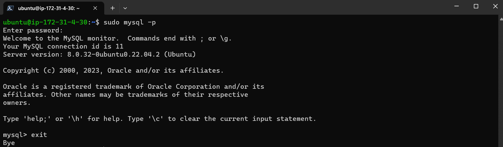

## Step 3 - Installing PHP
You’ll need to install php-fpm, which stands for “PHP fastCGI process manager”, and tell Nginx to pass PHP requests to this software for processing. Additionally, you’ll need php-mysql, a PHP module that allows PHP to communicate with MySQL-based databases. Core PHP packages will automatically be installed as dependencies.

To install these 2 packages at once, run `sudo apt install php-fpm php-mysql`

When prompted, type Y and press ENTER to confirm installation.
You now have your PHP components installed. Next, you will configure Nginx to use them.

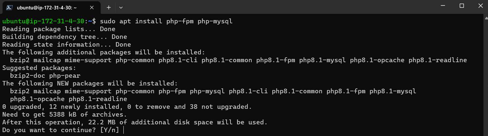

## Step 4 - Configuring NGINX To Use PHP Processor
When using the Nginx web server, we can create server blocks (similar to virtual hosts in Apache) to encapsulate configuration details and host more than one domain on a single server. In this guide, we will use project LEMP as an example domain name.

Create the root web directory for your domain as follows: `sudo mkdir /var/www/projectLEMP`

Let's assign ownership of the directory with the $USER environment variable, which will reference your current system user: `sudo chown -R $USER:$USER /var/www/projectLEMP`

Then, open a new configuration file in Nginx’s sites-available directory using your preferred command-line editor. Here, we’ll use nano: `sudo nano /etc/nginx/sites-available/projectLEMP`

paste this:

```
#/etc/nginx/sites-available/projectLEMP
server {
    listen 80;
    server_name projectLEMP www.projectLEMP;
    root /var/www/projectLEMP;
    index index.html index.htm index.php;
    location / {
        try_files $uri $uri/ =404;
    }
    location ~ \.php$ {
        include snippets/fastcgi-php.conf;
        fastcgi_pass unix:/var/run/php/php8.1-fpm.sock;
    }
    location ~ /\.ht {
        deny all;
    }
}
```

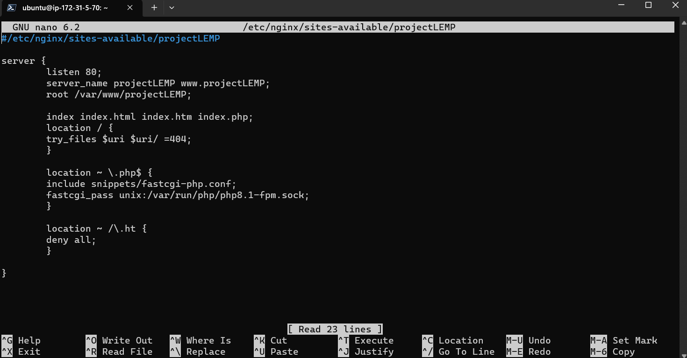


---
When you’re done editing, save and close the file. If you’re using nano, you can do so by typing: CTRL+X and then y and ENTER to confirm.

Activate your configuration by linking to the config file from Nginx’s sites-enabled directory: `sudo ln -s /etc/nginx/sites-available/projectLEMP /etc/nginx/sites-enabled/`

This will tell Nginx to use the configuration next time it is reloaded. You can test your configuration for syntax errors by typing: `sudo nginx -t`
You shall see following message:

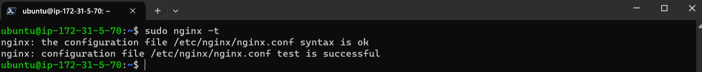


---
If any errors are reported, go back to your configuration file to review its contents before continuing.

We also need to disable default Nginx host that is currently configured to listen on port 80, for this run: `sudo unlink /etc/nginx/sites-enabled/default`

Let's reload Nginx to apply the changes: `sudo systemctl reload nginx`

Our new website is now active, but the web root /var/www/projectLEMP is still empty. Create an index.html file in that location so that we can test that your new server block works as expected: 
`sudo echo 'Hello LEMP from hostname' $(curl -s http://169.254.169.254/latest/meta-data/public-hostname) 'with public IP' $(curl -s http://169.254.169.254/latest/meta-data/public-ipv4) > /var/www/projectLEMP/index.html`

Now go to your browser and try to open your website URL using IP address: `http://"EC2-intance_Public-IP-Address":80`

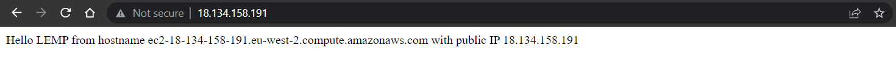


---
‘echo’ command we wrote to index.html file is there, this means our Nginx site is working as expected

---
Now lets try accessing the website with the DNS name: `http://"EC2-intance_Public-Public-DNS-Name":80`

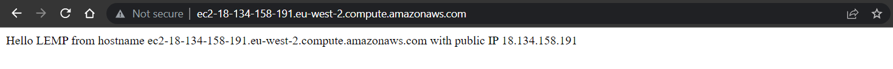

Your LEMP stack is now fully configured. In the next step, we’ll create a PHP script to test that Nginx is in fact able to handle .php files within your newly configured website.

## Step 5 - Testing PHP With NGINX
Open a new file called info.php within your document root in your text editor: `sudo nano /var/www/projectLEMP/info.php`

Type or paste the following lines into the new file. This is valid PHP code that will return information about your server:

```
<?php
phpinfo();
```

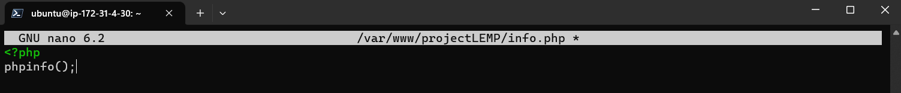

You can now access this page in your web browser by visiting the domain name or public IP address you’ve set up in your Nginx configuration file, followed by /info.php: `http://server_domain_or_IP/info.php`

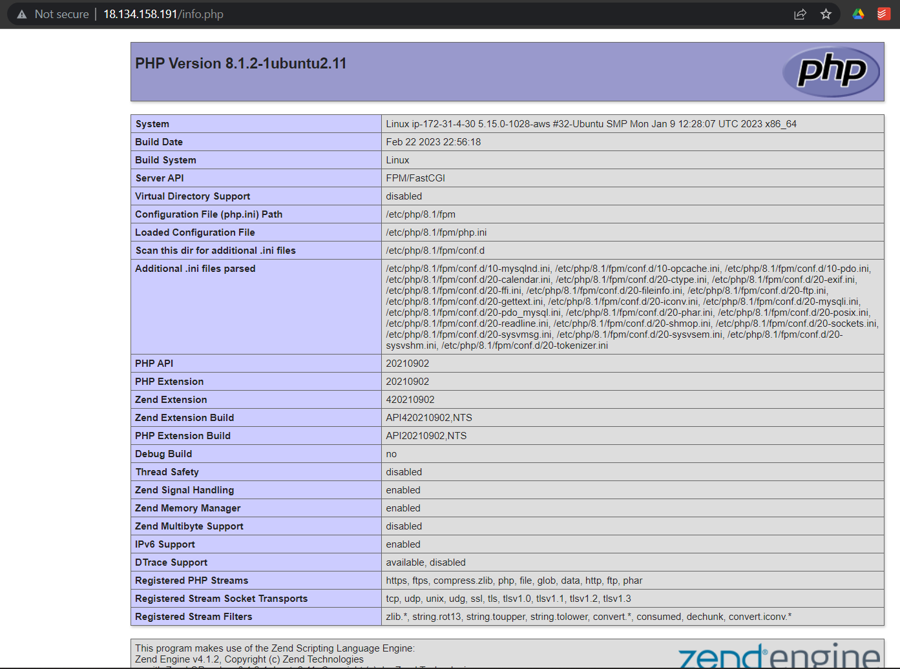

### 0R

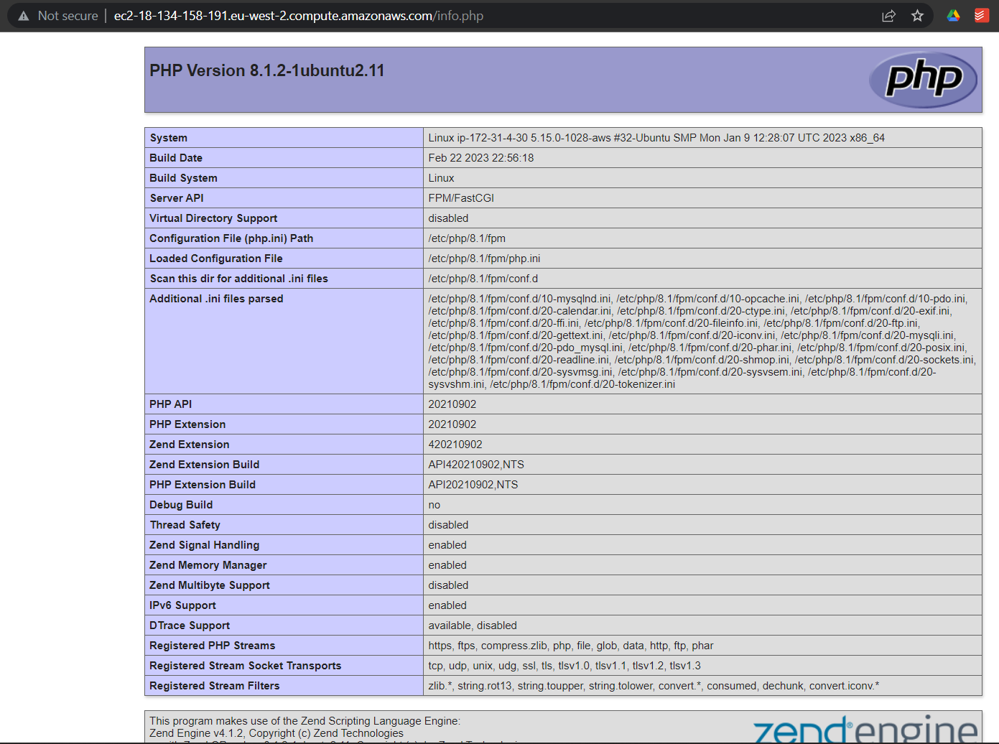

## Step 6 - Retrieving data from MySQL database with PHP

In this step we will create a test database (DB) with simple "To do list" and configure access to it, so the Nginx website would be able to query data from the DB and display it.

We will create a database named example_database and a user named example_user, but you can replace these names with different values.

First, connect to the MySQL console using the root account: `sudo mysql`

Lets create a new database, run the following command from your MySQL console: `CREATE DATABASE example_database;`

Now we can create a new user and grant him full privileges on the database we have just created.
`CREATE USER 'example_user'@'%' IDENTIFIED WITH mysql_native_password BY 'password';`

The following command above creates a new user named example_user, using mysql_native_password as default authentication method. We’re defining this user’s password as password, but you should replace this value with a secure password of your own choosing.

Now we need to give this user permission over the example_database database:
`GRANT ALL ON example_database.* TO 'example_user'@'%';`

This will give the example_user user full privileges over the example_database database, while preventing this user from creating or modifying other databases on your server.

 Now exit the MySQL shell with:
`exit`

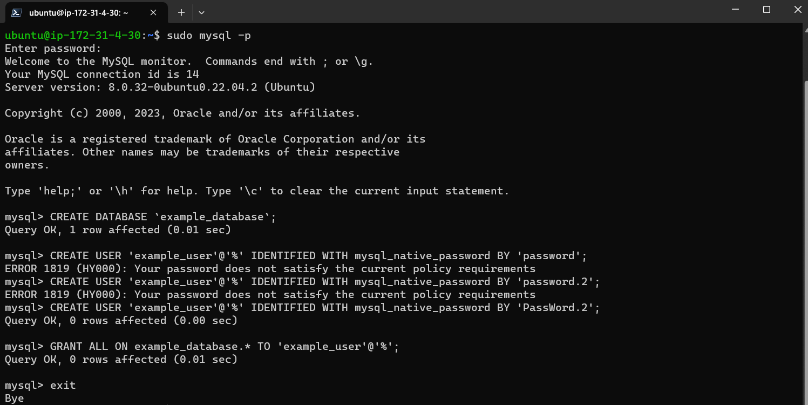

---
Lets test if the new user has the proper permissions by logging in to the MySQL console again, this time using the custom user credentials:

Lets test if the new user has the proper permissions by logging in to the MySQL console again, this time using the custom user credentials:
`mysql -u example_user -p`

Notice the -p flag in this command, which will prompt us for the password used when creating the example_user 
user. After logging in to the MySQL console, confirm that you have access to the example_database database:
mysql> `SHOW DATABASES;`
This will give you the following output:

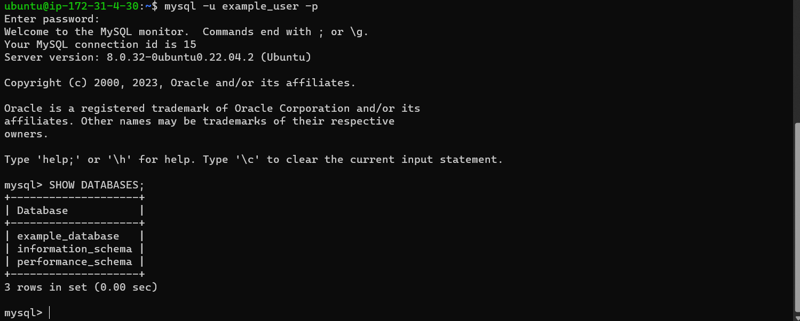

---
Now lets create a test table named todo_list. From the MySQL console, run the following statement:

```
CREATE TABLE example_database.todo_list (
	item_id INT AUTO_INCREMENT,
	content VARCHAR(255),
	PRIMARY KEY(item_id)
    );
```
You might want to repeat the next command a few times, using different VALUES:

`INSERT INTO example_database.todo_list (content) VALUES ("My first important item");`

- To confirm that the data was successfully saved to your table, run:
`SELECT * FROM example_database.todo_list;`

We should see the following output:

After confirming that you have valid data in your test table, you can exit the MySQL console: `exit`

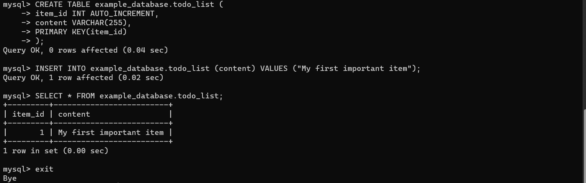

---
Now you can create a PHP script that will connect to MySQL and query for your content. Create a new PHP file in your custom web root directory using your preferred editor. We’ll use nano editor for that:
`nano /var/www/projectLEMP/todo_list.php`

The following PHP script connects to the MySQL database and queries for the content of the todo_list table, displays the results in a list. If there is a problem with the database connection, it will throw an exception.
Copy this content into your todo_list.php script:

```
<?php
$user = "example_user";
$password = "PassWord.1";
$database = "example_database";
$table = "todo_list";
try {
$db = new PDO("mysql:host=localhost;dbname=$database", $user, $password);
echo "<h2>TODO</h2><ol>";
foreach($db->query("SELECT content FROM $table") as $row) {
    echo "<li>" . $row['content'] . "</li>";
}
echo "</ol>";
} catch (PDOException $e) {
    print "Error!: " . $e->getMessage() . "<br/>";
    die();
}
```

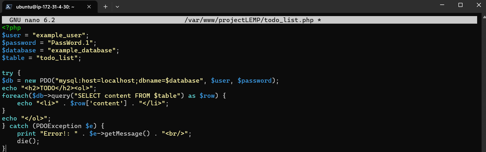

---
Save and close the file when you are done editing.

You can now access this page in your web browser by visiting the domain name or public IP address configured for your website, followed by /todo_list.php: `http://<Public_domain_or_IP>/todo_list.php`

You should see a page showing the content you’ve inserted in your test table.

Congratulations 🎉 that means your PHP environment is ready to connect and interact with your MySQL server.
